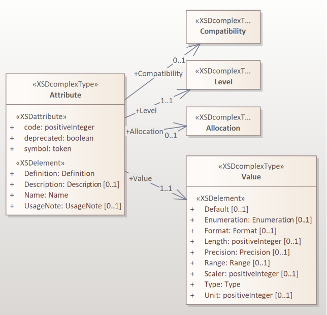
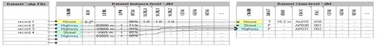
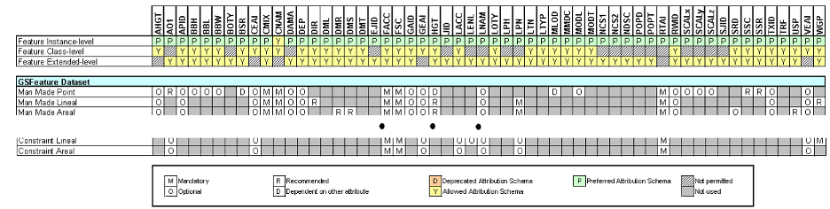
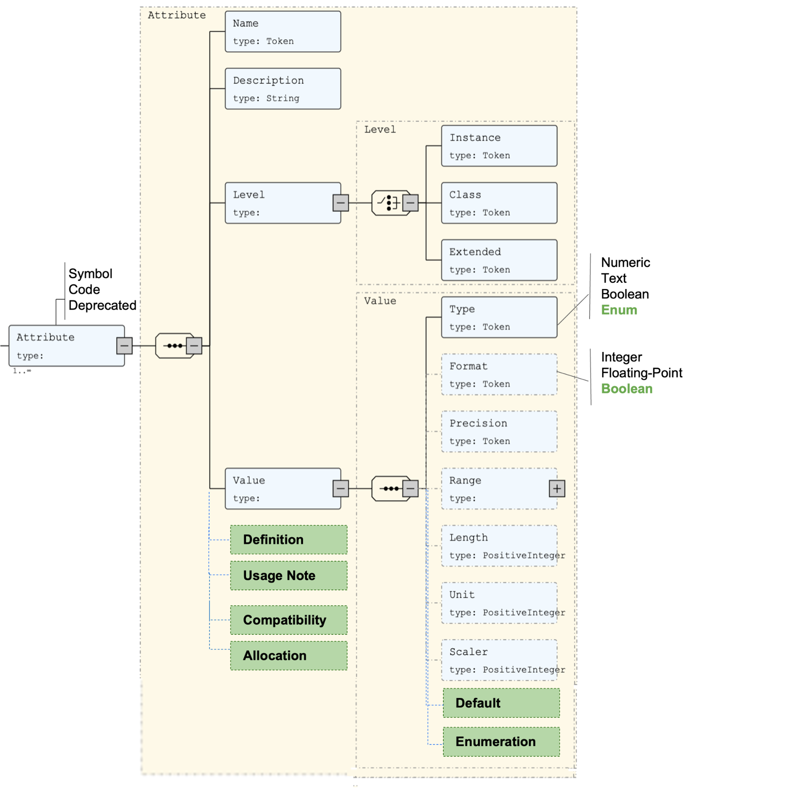
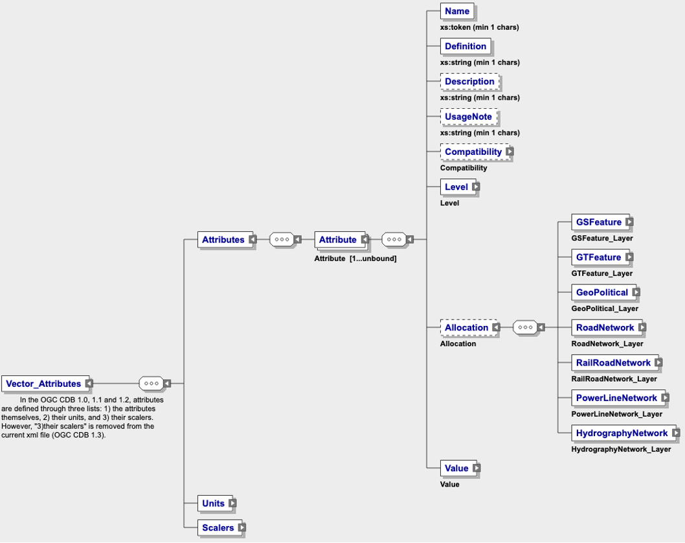
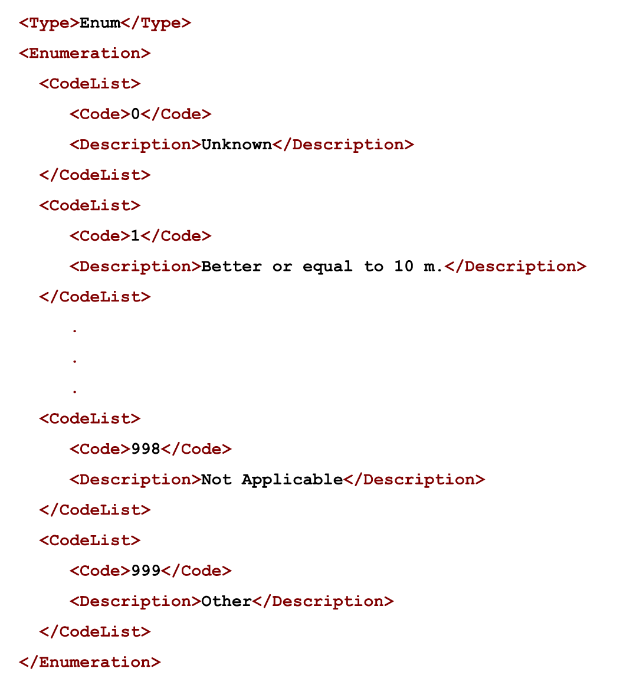
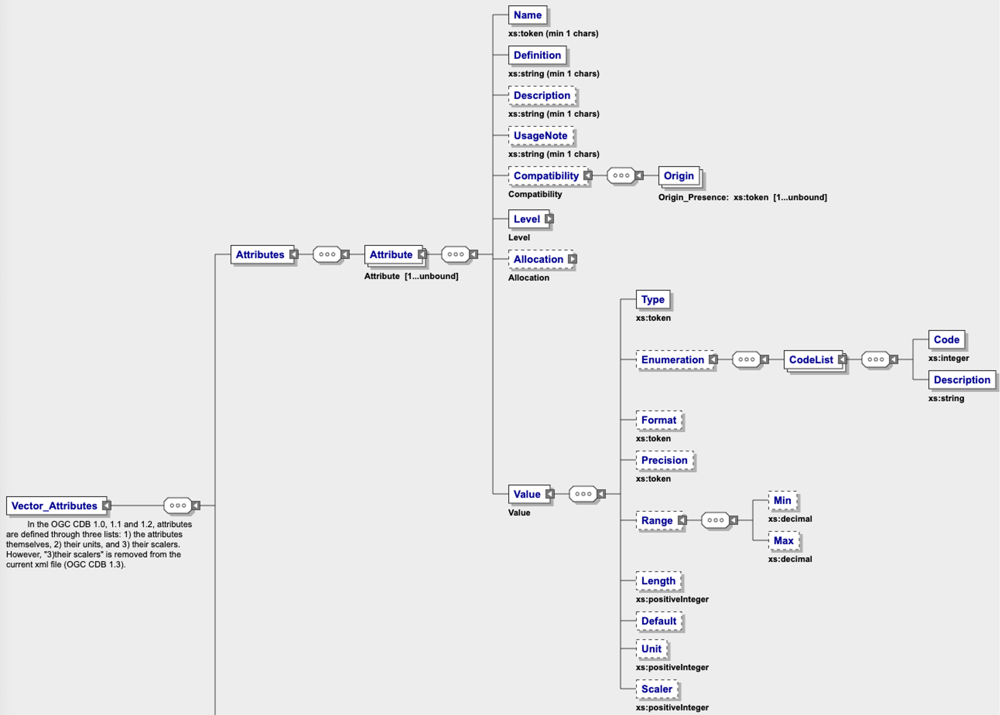
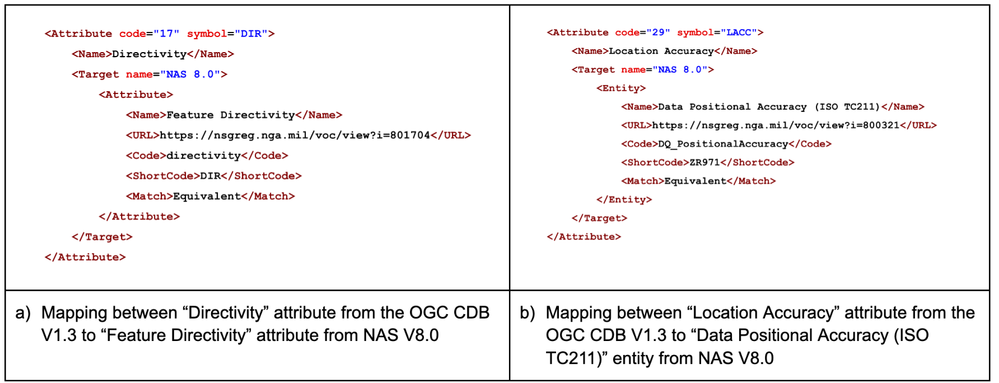

== CDB (V1.3) to NAS (V8.0) Attribute Mapping Guidance

The Open Geospatial Consortium (OGC) CDB Standard released in 2017 defines a standard way of organizing and encoding geospatial data, including textured terrain, imagery, multiple levels of detail, and the ability to store and display 2D and 3D features such as roads, buildings, and other infrastructure along with their attributes. CDB is designed for use in the creation and management of 3D geospatial datasets, particularly for 3D modeling and simulation across different systems and applications.The OGC CDB Standard has been published in three versions, namely V1.0, V1.1, and V1.2, with the current work being a part of the V1.3 version.
One of the persistent and important concerns with the OGC CDB V1.x footnote:["OGC CDB V1.x includes all the OGC CDB version 1 including V1.0, V1.1, V1.2, V1.3"] standard is how to evolve beyond the current use of CDB attributes and feature codes. OGC CDB Standard Working Group (SWG) members and users have expressed an interest in broader attributes and feature codes which embodies most (if not all) of the attributes encountered in the commonly used OGC standards. Specifically, a requirement to the National System for Geospatial Intelligence (NSG) Application Schema (NAS) was expressed. In the https://docs.ogc.org/per/17-042.html[OGC Testbed-13: CDB Engineering Report], participants evaluated how  feature codes and attribution schema are used in the CDB standard and  investigated how a specific profile ("Urban Military Profile") called NAS Profile can be developed and used in CDB.
The results of that effort along with the <<appendixSOFWERXSprint, SOFWERX Sprint ER Attributions sub-group Recommendations>> provide that basis for the content in this chapter. The objective of this chapter is to expand CDB attributes for supporting interoperability of existing CDB with the NAS-based feature codes and schemas.

A SOFWERX Sprint ER Attributions sub-group recommended that the CDB core conceptual model should not be limited to any specific data dictionary or content (<<appendixSOFWERXSprint,  Appendix for SOFWERX Sprint ER Attributions Sub-group Recommendations>>).
Instead, it should provide a metamodel that can describe any https://www.iso.org/obp/ui/#iso:std:iso:19109:ed-2:v1:en[ISO 19109:2015] compliant application schema as comprehensively as possible. The goal of Attributions sub-group document (<<appendixSOFWERXSprint,  Appendix for SOFWERX Sprint ER Attributions Sub-group Recommendations>>) is to support the development of an extension profile for CDB V1.3 that can work with any data dictionary that complies with https://www.iso.org/obp/ui/#iso:std:iso:19109:ed-2:v1:en[ISO 19109:2015]. To achieve this goal, a roadmap was presented in the CDB SWG, which involves mapping the CDB 1.3 to NAS 8.0. The first step in this process was to upgrade the CDB V1.3 Attribute schema by adding extra attributes to enable the mapping. These upgrades are described in Section <<#Schema_Mapping, Schema Mapping>> of this chapter. The second step was a manual mapping of the CDB attributes to NAS attributes and entities, section <<#Manual_Attribute_Mapping_from_CDB_to_NAS, Manual Attribute Mapping from CDB to NAS>>. The final  step involved implementing the mapping in XML to make the mapping between schemas machine-readable and easier to automate (Section <<#Machine_Readable_Attribute_Mapping, Machine Readable Attribute Mapping>>). This work provides insights into:

* Introduction of the OGC CDB V1.3 conceptual data model, and attribution schema;
* How OGC CDB V1.x supports organizing features and attributes;
* Evaluates the current solutions for mapping CDB V1.3 to NAS V8.0;
* The interoperability issues related to the mapping of multiple attribute/application schemas.

For example, if an analyst finds a CDB datastore with urban data and wants to use the data along with other data for simulation and visualization (_e.g._, NSG urban data), the analyst should be able to map the CDB attribute schema to NAS and vice versa. As the OGC CDB V1.x standards and NSG use different schemas to represent data, schema mapping can be used to map the data elements from one schema to the other, allowing the two datasets to exchange data seamlessly.

image::images/image91.png[image]
[#img_CDBandNASdataintegrationusingschemamapping,reftext='Figure 9-1']
*Figure 9-1. CDB and NAS data integration using schema mapping*

Schema mapping involves defining mappings between data elements in two different schemas. These mappings can be defined manually or by using automated tools. Manual mapping involves visually analyzing the data structures of the two schemas and manually mapping corresponding data elements. Automated mapping involves using software tools that can automatically identify common data elements in the two schemas and map them. Once the schema mappings are defined, data can be transformed from one schema to another using a data integration tool or middleware. This enables data to be exchanged and used seamlessly between systems, enabling for better collaboration and decision-making.

This chapter summarizes the steps to make the CDB V1.3 attribute schema as adaptable as possible to support a range of data dictionaries, specifically NAS V8.0 that comply with https://www.iso.org/obp/ui/#iso:std:iso:19109:ed-2:v1:en[ISO 19109:2015]. Modernization of attributes is important because it enables CDB to keep up with the ever-evolving technological, and community changes and enhance customer experience.

=== CDB Attribution Schema for Vector Features
In the OGC CDB V1.x standards, each vector feature is characterized by a set of attributes.
Attribution schemas are the method to handle these different types of attributes.
CDB attribution schemas files are encoded using the Extensible Markup Language (XML) format.

The vector attributes schema can be found in the '_Vector_Attributes.xsd_' file stored in the schema folder of a CDB datastore
(`\CDB\Metadata\Schema\Vector_Attributes.xsd`) and accessible from the
http://schemas.opengis.net/cdb/1.3/Vector_Attributes.xsd[official [yellow-background]#schema# file for vector attributes].
// ??update the link after the official schema published!!!

The list of CDB attributes is described in the '_CDB_Attributes.xml_' file stored in the metadata folder of a CDB datastore
(`\CDB\Metadata\CDB_Attributes.xml`) and accessible from the
https://schemas.opengis.net/cdb/1.3/Metadata/CDB_Attributes.xml[official [yellow-background]#CDB attributes# file].
// ??update the link after the official schema published!!!

==== CDB Vector Data Model

The following diagram shows the Unified Modeling Language (UML) representation for CDB V1.3 Attribute schema along with defining different entities and their properties, as well as the relationship between entities.

[#img_TheUMLdiagramoftheCDBV1.3vectorattributeschema,reftext='Figure 9-2']
*Figure 9-2. The UML diagram of the CDB V1.3 vector attribute schema*

The UML diagram was generated based on the '_Vector_Attributes.xsd_' file and consists of three elements: Attribute, Unit, and Scaler.
The Attribute element is the focus of this chapter.
The following table  defines the major components of CDB attributes for vector data.
In CDB V1.3, please refer to [yellow-background]#Section 10.1.8# (CDB Attributes Metadata) of Volume 1 (OGC CDB V1.3: Volume 1 Standard)
// ??this link and section number should be updated after publishing volume one
for a detailed definition of the UML model components.

[#Themajorcomponents]
.The major components of UML model definition
|===
|Name|Definition

|Attribute| Attributes are used to describe one or more real or virtual characteristics of a feature. Attributes have three characteristics: +
- Code: A unique four-digit numeric code associated with each attribute. +
- Symbol (Identifier): A unique three-character or four-character alphanumeric identifier associated with the attributes that are governed by this standard. +
- Deprecated: States if the attribute is deprecated or not.

|Compatibility| It provides compatibility and origin of attributes specified in the OGC CDB V1.x standard. The current values are OGC CDB 1.0, DIGEST 2.1, DIGEST, and SEDRIS (EA = 562).

|Allocation| This element shows allocation of CDB attributes to each of the Vector datasets. The CDB standard limits the applicability of each of the CDB attributes to certain vector datasets.

|Level| Provides the schema level of the attribute such as class-level, instance-level and extended-level.

|Value| Attribute values give quantitative/qualitative meaning to the attribute. This property includes data type, enumeration, length, format, range, precision, unit, and scaler of each attribute.
|===

The OGC CDB V1.x standards provide three levels to represent the attributes of a feature: Instance-level attribution schema, Class-level attribution schema, and Extended-level attribution schema. Each of the schemas offers different trade-offs in how the attribution data is accessed and stored. Each of these schemas is largely motivated by storage size considerations, and flexibility of the attributes which are assigned to individual features or to a group of features.

Although class attributes are common to several instances of a feature, optimization is not worth the cost of another read file I/O and the additional complexity to processing code. However, for compatibility, class-level attributes are still supported. The same for extended attributes. The intention and preference as specified in the CDB V1.0 Standard were to promote storing all CDB attributes with the instance-level and avoid writing the class-level attributes. The same logic applies to Geomatics and Extended Attributes. The CDB Feature Data Dictionary (FDD) can be extended by using the extension capabilities and adding the new feature codes into the FDD XML or adding a new attribute into the Vector Attribute schema file to access additional feature codes/attributes. However, this mechanism is so slow and is not used widely. The <<appendixSOFWERXSprint, SOFWERX Sprint ER Attributions sub-group Recommendations Document>> recommended avoiding extended-level attributes in the CDB.

For example, a CDB datastore instance can use Esri Shapefiles to represent vector data and attributes. As per the Esri Shapefile Technical Description, the set of attributes of vector features are stored in dBase III+ files (<<#img_AnexampleofInstance-levelandClass-levelattributionschemainvectorshapefiles>>).

[#img_AnexampleofInstance-levelandClass-levelattributionschemainvectorshapefiles,reftext='Figure 9-3']
*Figure 9-3. An example of Instance-level and Class-level attribution schema in vector shapefiles*

An  example of allocation of CDB attributes to datasets is shown in the following figure that can be used as a schema for the attribute allocation (<<#img_AllocationofCDBattributestodatasets>>). Attributes are either Mandatory, Optional, not permitted, or not used .

[#img_AllocationofCDBattributestodatasets,reftext='Figure 9-4']
*Figure 9-4. Allocation of CDB attributes to datasets*

More information on CDB vector data model is provided in [yellow-background]#Section 10.1.8# (CDB Attributes Metadata) of Volume 1 (OGC CDB V1.3: Volume 1 Standard).
// ??this link and section number should be updated after publishing volume one

=== NAS

The https://nsgreg.nga.mil/nas/[National System for Geospatial Intelligence (NSG) Application Schema (NAS)] specifies a platform independent model for geospatial data. The geospatial semantics are specified in the NSG Entity Catalog (NEC) and NSG Feature Data Dictionary (NFDD). The NAS conforms to https://www.iso.org/obp/ui/#iso:std:iso:19109:ed-2:v1:en[ISO 19109:2005 Rules for Application Schema] as well as conceptual schemas specified by other ISO 19100-series standards. The NAS includes entity modeling for modeling features, events, names and coverages (_e.g._, grids, rasters, and TINs).

NAS is an example of recent modern feature data models that include geospatial data semantics, supports net-centric geospatial services, and is capable of achieving geospatial data interoperability.

As the NAS specifies an NSG-wide model for geospatial data that supports a wide variety of domains and applications, defining subsets of the NAS that meet specific requirements for specific domains is advantageous. In these cases mapping between a specific profile of the NAS with other schemas is possible.

==== NAS Data Model

The NSG Application Schema (NAS) - Part 1 - specifies an NSG-wide logical model for geospatial data that is technology neutral. The NAS - Part 1 conforms to https://www.iso.org/obp/ui/#iso:std:iso:19109:ed-2:v1:en[ISO 19109:2015], Geographic information - Rules for application schema, and its conceptual schema. The NAS - Part 1 integrates conceptual schemas from multiple ISO 19100-series standards for geospatial information modeling, such as those for features, events, names and coverages (_e.g._, grids, rasters, and Triangulated Irregular Networks (TINs)).

The NAS - Part 1 ensures that there is a clear, complete, and internally-consistent NSG logical geospatial data model that may be used to derive system-specific implementation models/schemas in a rigorous manner - NAS data model ensures that data integrity is preserved when geospatial data is exchanged between different system implementations within the NSG. It also reduces the cost of evolving system-specific implementations to meet evolving system, mission and customer requirements while promoting data agility.

The NAS - Part 1 leverages and integrates geospatial information modeling practices from multiple community models
(_e.g._, Multinational Geospatial Co-Production Program (MGCP),
Digital Geospatial Information Working Group
Feature Data Dictionary (DFDD),
Aeronautical Information Exchange Model (AIXM),
Modernized Integrated Database (MIDB),
Electronic Navigational Chart (ENC),
NATO Additional Military Layers (AML), and others)
whose data are used and exchanged by NSG component systems. The NAS entities are organized into logical subject matter https://nsgreg.nga.mil/as/view?i=132013[Views and View Groups] for better searching and discovery capabilities by subject matter experts.

NAS data model register provides the following services:

* https://nsgreg.nga.mil/registries/browse/index.jsp?registryType=as&register=NAS[Browse] or https://nsgreg.nga.mil/registries/search/index.jsp?registryType=as&register=NAS[Search] an entire list or subset of:
** Entity Types (_e.g._, bridge, forest, highway, railway yard)
** Entity Inheritance Relations (_e.g._, bridge is a subclass of feature entity)
** Entity Attributes (_e.g._, color, composition, height, name)
** Datatypes [with Datatype Listed Values] (_e.g._, Boolean, Colour Code [red, yellow, green], Real, Text)
** Datatype Inheritance Relations (_e.g._, Boolean with metadata is a subclass of Datatype with metadata)
** Entity Associations [with Association Roles] (_e.g._, bridge country [bridge-located country, location country of bridge])
** Constraints (_e.g._, runways may be represented only as curves or surfaces)
* Model review – a Model consists of a set of UML Schemas and Packages that organize the Entity Types and Datatypes of the register in accordance with a logical data model perspective and for the purpose of software development and reuse.
* Information Context review – an Information Context consists of a set of View Groups and a set of Thematic Groups.
** View Groups organize the contents of the register in accordance with appropriate subject matter perspectives for the purpose of information content discovery and inspection.
** Thematic Groups organize the contents of the register in accordance with common functional purposes in specific contexts (for example: air operations, ground warfighting, safety of navigation).
Both types of groups collect sets of *Information Views* that have associated Entity Types and Datatypes.

More information on NAS is available from https://nsgreg.nga.mil/nas/[NAS website].

=== Comparison of the CDB and NAS Schemas

When comparing two schemas, it is important to consider their underlying structures and how they organize and store data. One application schema may be more complex than the other, with multiple tables and relationships between them, while the other may have a simple flat structure. The choice of schema design will depend on the specific needs of the application and the types of data being stored. Additionally, it is important to consider the performance and scalability of the schema, as a poorly designed schema can lead to slow queries and inefficiencies as the volume of data grows. Ultimately, a well-designed schema should provide efficient data storage, easy data retrieval, and allow for flexibility in future modifications to the application. The following table compares the OGC CDB V1.3 with NAS V8.0 schemas.

[#OGCCDBV13withNASV80schemacomparison]
.OGC CDB V1.3 with NAS V8.0 schema comparison
|===
|*CDB Feature Codes and Attributes*| *NAS Application Schema*

|One simple feature with attributes (which are single data items, _e.g._, text, number, etc.)|Multiple different types of complex features.

|Schema can be automatically generated based on a relational database (i.e., it is straightforward).|Schema agreed by community and richly featured data standards.

|CDB has a “Simple Feature Schema” with association and reusability.|NAS is an “Application Schema” with formal description of the data structure and content required by one or more applications. It contains the descriptions of both geographic data and other related data.

|Interoperability relies on simplicity and customization.|Interoperability through standardization _e.g._, https://www.iso.org/obp/ui/#iso:std:iso:19109:ed-2:v1:en[ISO 19109:2015].
|===

This chapter exclusively covers the mapping from CDB to NAS, while the reverse mapping is not included. Nonetheless, it is possible that in the future, the reverse mapping between various NAS and CDB profiles may be examined. The first step for mapping from CDB V1.3 to NAS V8.0 is to upgrade the CDB V1.3 Attribute schema to include additional attributes for implementing the mapping. Section <<#CDB_Attribution_Roadmap, CDB Attribution Roadmap>> describes those upgrades. The second step was the manual mapping from the CDB attributes to NAS attributes and entities which is covered in section <<#Mapping_CDB_Vector_Attributes_to_NAS, Mapping CDB Vector Attributes to NAS>>.

=== CDB Attribution Roadmap (SOFWERX Sprint)
[#CDB_Attribution_Roadmap]

As described in <<appendixSOFWERXSprint, Appendix for SOFWERX Sprint ER Attributions Sub-group Recommendations>>, there are seven recommendations generated by the SOFWERX Sprint ER Attributions sub-group. Although certain recommendations pertain to CDB V2.x and are beyond the scope of this document, the majority center on updating the attributes requirements in OGC CDB V1.3 to align with modernization efforts. The SOFWERX Attributions sub-group proposes enhancing the existing CDB V1.3 XML metadata by integrating the NAS metamodel capabilities, which are currently not supported in the OGC CDB V1.x standard. The present document includes only those recommendations that are relevant to this undertaking and are itemized below.

. Create an OGC CDB V1.3 schema includes `Compatibility_ (Origin), Definition, Usage Note, Default, Enumerations and Allocation` in the '_Vector_Attributes.xsd_' file
. Add `Compatibility` (Origin) property to all attributes in the '_CDB_Attributes.xml_' file
. Add `Definition` property to  to all attributes in the '_CDB_Attributes.xml_'
. Add `Usage Note` property to  to all attributes in the '_CDB_Attributes.xml_'
. Add `Default` property to  to all attributes in the '_CDB_Attributes.xml_'
. Add `Enumerations` property to  to all attributes in the '_CDB_Attributes.xml_'
. Add `Allocation` property to  to all attributes in the '_CDB_Attributes.xml_'

==== OGC CDB V1.3 Schema Updates

The first step for updating CDB vector attributes is to add modifications to the schema.

[#img_ComparisonofVector_Attributes,reftext='Figure 9-5']
*Figure 9-5. Comparison of '_Vector_Attributes.xsd_' in the OGC CBD V1.2 with the OGC CDB V1.3: Green boxes/Bold text added to the vector attribute schema as a new element, property or enumeration.*

In the above figure (<<#img_ComparisonofVector_Attributes>>), the green boxes were added to the CDB schema to capture all the details in the OGC CDB V1.x standard and make it more compatible with the NAS. For example, Definition and Compatibility (Origin) are two tags that are included in the NAS schema as well.

The following sections describes updating '_CDB_Attributes.xml_' file with Compatibility (Origin), Definition, Usage Note, Default Values, Enumeration, and Allocations properties.

==== Add `Compatibility` (Origin)

When working with NAS-based schemas such as GGDM  (Ground-warfighter Geospatial Data Model), `Compatibility` (Origin) is increasingly important for configuration management of the specification.
Also, if mixing and matching multiple attribution definitions - such as combining a NAS profile with a detailed vegetation model and a separate BIM model - is required then tracking the individual origins of particular definitions helps to deconflict overlaps and maintain the standard itself.

Currently CDB V1.2 specifies the “Origin” of attributes in the CDB V1.2 - Vol 1 that documents the originating standard of the definition. This “Origin” property is added in the XML schemas as <Compatibility> tag to the '_Vector_Attributes.xsd_' file and all relevant attributes are updated in '_CDB_Attributes.xml_' file. <Compatibility> tag is implemented as a sequence to describe the full history since a particular term may have originated in an older standard but included in newer standards or possibly amended.

A list of standardized origins are OGC CDB 1.0, DIGEST 2.1, DIGEST, and SEDRIS (EA = 562) along with the CDB 1.0 Traditional Attribute.

==== Add `Definition`

In the previous version of the '_CDB_Attributes.xml_' file, all the information about each attribute was explained in the <Description> tag. However, for  more specific  details  type  <Definition> and <Description> are free-form text defining and describing the attribute, respectively.

==== Add `Usage Note`

The <UsageNote> element contains notes related to how to apply the attribute in the CDB datastore.

==== Add `Default Values`

One ongoing challenge is how to handle missing attribute values that are needed for runtime simulation. The default value is a necessary capability to support consistent and interoperable procedural generation across different simulations and tool workflows. Attribute default values are documented in the CDB V1.2 - Vol 1, however, the machine-readable XML metadata does not contain any of this information. One of the changes in the CDB V1.3 is to add <Default> tag to the schema ('_Vector_Attributes.xsd_' file) and to each of the CDB attributes ('_CDB_Attributes.xml_' file) to be used in a machine readable format. For the CDB V1.3, per-entity defaults is considered as an straightforward extension that could be a transition path for more per-dataset default values.

==== Add `Enumeration`

Attributes describing qualitative values are present in CDB V1.2- Vol 1. This volume list all valid values for each attribute are documented in the human-readable specification with both the vocabulary term name and its integer numeric value (index). However, the machine-readable XML metadata does not contain any of this information and treats these attribute types as raw integers with only a minimum and maximum value constraint.

One of the changes in the CDB V1.3 is to update the schema  ('_Vector_Attributes.xsd_' file) with <Enumeration> element  in a backward compatible way to capture these definitions from the existing specification into the machine-readable XML metadata. Also the qualitative values of each attribute, known as enumerations, are added into the XML metadata ('_CDB_Attributes.xml_' file) and in all relevant places in the standard specification. The <Enumeration> element includes code-lists to define listed values (also known as enumerates) describing the valid vocabulary terms for the enumeration. Each code-list value defines two properties, code and description. It is worth mentioning here that when we need to have an enumeration element, the type element value would be set to Enum in advance. The following sample illustrates an example of an enumeration element in XML format. As it is shown, type element value sets to Enum in relation to the enumeration element.

*The sample XML description of Type and Enumeration elements.*
[source,xml]
----
<Type>Enum</Type>
<Enumeration>
  <CodeList>
     <Code>0</Code>
     <Description>Unknown</Description>
  </CodeList>
  <CodeList>
   	<Code>1</Code>
     <Description>Better or equal to 10 m.</Description>
  </CodeList>
     .
     .
     .
  <CodeList>
     <Code>998</Code>
     <Description>Not Applicable</Description>
  </CodeList>
  <CodeList>
     <Code>999</Code>
     <Description>Other</Description>
  </CodeList>
</Enumeration>
----

==== Add `Allocation`

The allocation table, which is shown in <<#img_AllocationofCDBattributestodatasets>>, is currently converted to an XML file in the OGC CDB V1.3 Standard. The table is included in the '_CDB_Attributes.xml_' file (`\CDB\Metadata\CDB_Attributes.xml`). A new property called “Allocation” was added to the attribute element.
In order to adopt this change, the '_Vector_Attributes.xsd_' file (`\CDB\Metadata\Schema\Vector_Attributes.xsd`) is updated.
These changes are provided in the OGC CDB V1.3 revision.
Attributes are either mandatory, optional, not permitted, or not used.

[#img_AllocationelementaddedtotheOGCCDBV13,reftext='Figure 9-6']
*Figure 9-6. Allocation element added to the OGC CDB V1.3 vector attribute schema*

As can be seen in the following figure (<<#img_AllocationelementaddedtotheOGCCDBV13>>), feature codes (FACC and FSC) are two mandatory attributes for CDB vector features. The CDB attribution schema limits the applicability of each of the CDB attributes to certain vector datasets, value ranges, and units. This approach helps to reduce the size of the dataset instance and class-level attribution files. This CDB data model is used for the representation of many features using the modeler in real-time simulation.

=== Mapping CDB Vector Attributes to NAS
[#Mapping_CDB_Vector_Attributes_to_NAS]

The process of mapping CDB vector attributes to NAS involves identifying the similarities and differences between the attribute schema of CDB and NAS data models and finding ways to translate between them. Since CDB and NAS have different attribute schemas, mapping the schemas first to ensure that the data can be correctly interpreted by NAS is required. The second step is to evaluate each CDB attribute first and find the corresponding NAS attribute(s). After that, the mapping is documented in the metadata XML. To implement this mapping, the OGC CDB V1.x standard and the latest normative NAS version (NAS 8.0), or the latest experimental NAS version (NAS X-3) are used as the target versions.

==== Schema Mapping
[#Schema_Mapping]

Schema mapping process involves analyzing the attributes of both systems, identifying any overlaps or discrepancies, and establishing a set of rules to translate the data from CDB to the NAS. By mapping CDB vector attributes to NAS, it becomes possible to ensure compatibility between different data models and facilitate the exchange of data between systems that use different formats.

[#img_CDBV1.3updatedschema,reftext='Figure 9-7']
*Figure 9-7. CDB V1.3 updated schema*

==== Manual Attribute Mapping from CDB to NAS
[#Manual_Attribute_Mapping_from_CDB_to_NAS]

This step involves the crosswalk, matching, and mapping of every attribute of two schemas, namely CDB and NAS. To map CDB attributes, the target version of NAS  is the latest normative NAS version (NAS V 8.0). NAS V8.0 adds substantial definitions in the maritime and aeronautics domains that may be necessary for CDB.

In the manual mapping process from OGC CDB V1.x to NAS V8.0, all the CDB vector attributes are taken into account.
Nevertheless, certain vector attributes are inherent to the OGC CDB Standard (<<appendixB, [yellow-background]#Appendix B#>>)
// ??We need to remove AppendixB as it is redundant  with Vol 1
and cannot be translated to other schemas such as NAS. The remaining attributes are used for the mapping between OGC CDB V1.3 and NAS V8.0.

In this step, all attributes with the similar characteristics in both CDB and NAS are extracted. As you can see in Table 4, from the CDB, name, code, symbol and definition of each attribute is exported. The name, code, definition, digest attribute and type of similar attribute on NAS was extracted to match the CDB attributes. Attribute mapping can be done manually using the following table to list the corresponding data elements in CDB and NAS schemas. Table 4 shows an example of how to create a schema mapping table manually.

[#Manual_Mapping_Table]
.Manual Mapping Table from CDB V1.3 attributes to NAS V8.0

|===
|*OGC CDB V1.3*||||*NAS V8.0*|||||
|*Name*|*code*|*symbol*|*Definition*|*Name*|*code*|*DIGEST Attribute/Feature Code*|*Definition*|*Source Item Identifier*|*Type*
|Directivity|17|DIR|The side or sides of a feature that has the greatest reflectivity potential.|https://nsgreg.nga.mil/as/view?i=101989[Feature Directivity]|directivity|DIR|The sides of a feature that produce the greatest visual significance and/or reflectivity potential.|https://nsgreg.nga.mil/voc/view?i=801704[801704]|Attribute
|Density Measure (% roof cover)|19|DMR|Percentage of roof coverage within the area delimited by a polygon feature.|https://nsgreg.nga.mil/as/view?i=101991[Roof Cover]|roofCover|DMR|The portion of an area that contains structures having roofs or tops (for example: buildings and storage tanks).|https://nsgreg.nga.mil/voc/view?i=802834[802834]|Attribute
|Density Measure (structure count)|20|DMS|Number of man-made structures per square kilometer of polygon features.|https://nsgreg.nga.mil/as/view?i=101992[Structure Density]|structureDensity|DMS|The density of structures in an area.|https://nsgreg.nga.mil/voc/view?i=803030[803030]|Attribute
|Location Name|32|LNAM|A name that corresponds to a GeoPolitical Location.|https://nsgreg.nga.mil/as/view?i=106883[Administrative Name]|adminName|ANM|A name of a geopolitical entity or|https://nsgreg.nga.mil/voc/view?i=801228[801228]|Attribute
|Location Type|33|LOTY|A value that uniquely attributes the location type of point, line or polygon features.|https://nsgreg.nga.mil/as/view?i=106130[Geopolitical Entity Type]|geopoliticalEntityType|GEC|The type of a legally recognized geopolitical entity (for example: a State or a zone).|https://nsgreg.nga.mil/voc/view?i=801941[801941]|Attribute
|Lane/Track Number|36|LTN|The number of lanes on a road, tracks on railroad, or conductors on powerlines, including both directions.|https://nsgreg.nga.mil/as/view?i=103057[Track or Lane Count]|trackOrLaneCount|LTN|The total number of independent, parallel paths (for example: a railway track and/or a road lane) in both directions within a route.|https://nsgreg.nga.mil/voc/view?i=803139[803139]|Attribute
|Surface Roughness Description|59|SRD|Describes the condition of the surface materials that may be used for mobility prediction, construction material, and landing sites.|https://nsgreg.nga.mil/as/view?i=105636[Terrain Morphology]|terrainMorphology|SRD|The type of terrain morphology based on composition and/or configuration.|https://nsgreg.nga.mil/voc/view?i=803081[803081]|Attribute
|Structure Shape Category|60|SSC|Describes the Geometric form, appearance, or configuration of the feature.|https://nsgreg.nga.mil/as/view?i=101834[Structure Shape]|structureShape|SSC|The geometric form, appearance, and/or configuration of the feature as a whole.|https://nsgreg.nga.mil/voc/view?i=803031[803031]|Attribute
|Structure Shape of Roof|61|SSR|Describes the roof shape.|https://nsgreg.nga.mil/as/view?i=154732[Roof Shape]|roofShape|SSR|A configuration and/or appearance of a roof.|https://nsgreg.nga.mil/voc/view?i=802836[802836]|Attribute
|Traffic Flow|62|TRF|Encodes the general destination of traffic.|https://nsgreg.nga.mil/as/view?i=105331[Traffic Flow]|trafficFlow|TRF|The type of traffic flow on a maritime route based on direction, origin, and/or destination.|https://nsgreg.nga.mil/voc/view?i=803145[803145]|Attribute
|Urban Street Pattern|64|USP|Describes the predominant geometric configuration of streets found within the delineated area of the feature.|https://nsgreg.nga.mil/as/view?i=130474[Settlement Pattern]|settlementPattern|USP|The pattern of settlement of an urban area based on the most frequently occurring geometric configuration (pattern) of streets and/or canals.|https://nsgreg.nga.mil/voc/view?i=802923[802923]|Attribute
|Density Measure (% tree/canopy cover)|21|DMT|Percentage of canopy coverage within the area delimited by a polygon feature during the summer season.|https://nsgreg.nga.mil/as/view?i=130443[Canopy Cover]|canopyCover|DMT|The fraction of canopy cover within a defined area during the season of maximum foliage.|https://nsgreg.nga.mil/voc/view?i=801515[801515]|Attribute
|Location Accuracy|29|LACC|A precision value used to quantify the relative precision of the Location point representing the specific GeoPolitical Location.|https://nsgreg.nga.mil/as/view?i=194840[Data Positional Accuracy] (https://www.iso.org/committee/54904/x/catalogue/[ISO TC211])|DQ_PositionalAccuracy|ZR971|An assessment of the quality of a resource based on the accuracy of the position of its spatial content (for example: features), as determined by https://www.iso.org/obp/ui/#iso:std:iso:19157:ed-1:v1:en[ISO 19157:2013].|https://nsgreg.nga.mil/voc/view?i=800321&month=7&day=13&year=2020[800321]|Entity
|===

==== Machine Readable Attribute Mapping
[#Machine_Readable_Attribute_Mapping]

To convert Table 4 into a machine readable format, a “SchemaMapping” subfolder was added to the Schema folder (`\CDB\Metadata\Schema\`) of the OGC CDB V1.3 Standard. This folder includes two files: 1. “Schema_Mapping.xsd” file is a schema to map CDB Vector Attributes to other application schemas such as NAS V8.0. This file (“Schema_Mapping.xsd”) can be extended in future to include other schema mappings for the CDB V1.x;  2. “NAS_Mapping.xml” which captures the mapping from CDB V1.3 attributes to NAS V8.0 attributes or entities derived from Table 4. If other schema mappings are available for the CDB, their implementation as an .xml files (_e.g._, “DGIF_Mapping.xml”, “CityGML_Mapping.xml”, and etc.) can also be added to the “SchemaMapping” subfolder. This method can be easily parsed by users who need it, but  does not affect any users who want to implement the CDB Standard without mapping.

[#img_“Schema_Mapping.xsd”filewhichshowsmapping,reftext='Figure 9-8']
*Figure 9-8. “Schema_Mapping.xsd” file which shows mapping from the OGC CDB V1.3 Attributes to the “Target” which is NAS V8.0 Attributes/Entities*

The following figure shows two different attribute examples from CDB that are mapped to a NAS attribute and a NAS entity as provided in the “NAS_Mapping.xml” file. This “NAS_Mapping.xml” file is captured from manual attribute mapping provided in Table 4. On the left (<<#img_TheXMLdescriptionfortwoattributes>>-a), the mapping is between CDB attribute to NAS attribute and on the right (<<#img_TheXMLdescriptionfortwoattributes>>-b) the mapping is from CDB attribute to NAS entity.

[#img_TheXMLdescriptionfortwoattributes,reftext='Figure 9-9']
*Figure 9-9. The XML description for two attributes of NAS mapping.*

=== Conclusion and Future Work

As recommended by the SOFWERX Sprint ER Attributions sub-group, the CDB core conceptual model should not mandate any particular data dictionary or content. Instead, the CDB Standard should provide the conceptual and logical metamodel for describing any https://www.iso.org/obp/ui/#iso:std:iso:19109:ed-2:v1:en[ISO 19109] compliant application schema to the maximum practical extent. There should be no technical reason why one could not develop an extension profile for CDB for any particular data dictionary that complies with https://www.iso.org/obp/ui/#iso:std:iso:19109:ed-2:v1:en[ISO 19109]. To achieve this goal for the CDB V1.3, a roadmap was presented in the CDB SWG to map the CDB V1.3 to NAS 8.0 in an effort to evaluate the possibilities of the current CDB application schema.

The CDB V1.x series of  standards specify a file-based datastore. As such schemas are necessary to view data at different levels of abstraction. CDB therefore has an internal/physical schema for indexing folders, and file names for random access disk systems. This system is useful for fast access , but not semantics. Rapid implementation of new features and changing the indexing structures is difficult to make. However, useful routines can be hardcoded or represented in an xml file to deal with the physical representation.

Designing a method for having a mapping between the two application schema or adding additional feature codes should maintain the compatibility. Data does nothing in the absence of an interpreter (such as a database generation tool or a client device). As a result, the notion of compatibility does not apply to the CDB itself, it also applies to software that reads or writes the CDB. There are two types of compatibility that should be considered:

* Backward compatibility: Refers to the ability of an interpreter implemented to version n of the standard to accept a CDB compliant to version (n-1) of the standard. Logically, if version (n-1) is also backward compatible with version (n-2), which in turn is backward compatible with version (n-3), then version n is backward compatible with the oldest version that is not backward compatible with its predecessor.
* Forward compatibility: Refers to the ability of a software program to accept input intended for a later version of itself and pick out the "known" part of the data. Forward compatibility is harder to achieve than backward compatibility because a software program needs to cope smoothly with an unknown future data format or requests for unknown future features.
The other important factor in the OGC CDB standard is the performance issue associated with the mapping and  extended attributes. Since all the data sources in CDB need to use extended feature attributes, there will be a performance bottleneck in run-time implementations. Therefore, addressing a method for extended feature attributes should address these issues.

This chapter exclusively covers the mapping from CDB to NAS, while the reverse mapping is not included. Nonetheless, it is possible that in the future, the reverse mapping between various NAS and CDB profiles may be examined.
